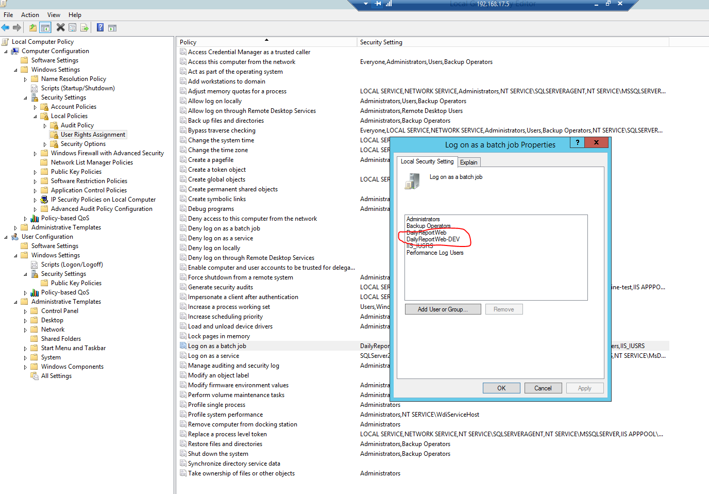

## Deployment settings ##

 1. Create a user (e.g. DailyReportWeb) 
 2. Give full rights on the following folders: 
	 - DailyReportWeb (web app folder)
	 - DailyReportTool (tool folder)
	 - %windir%\Temp
	 - %windir%\System32\Tasks\DailyReport (create the folder)
 3. Assign the user the *Log on as Batch Job* right using gpedit.msc
	 
 4.  Set the user as the user for the application pool running DailyReportWeb under IIS.

